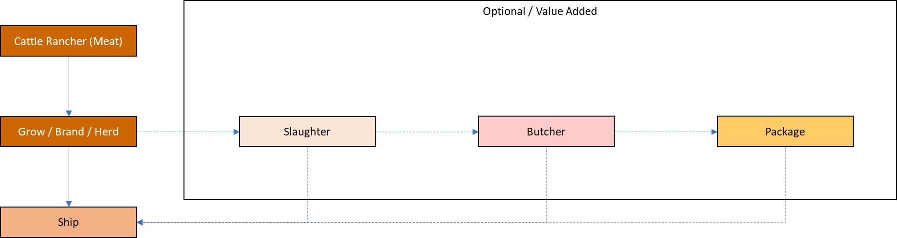
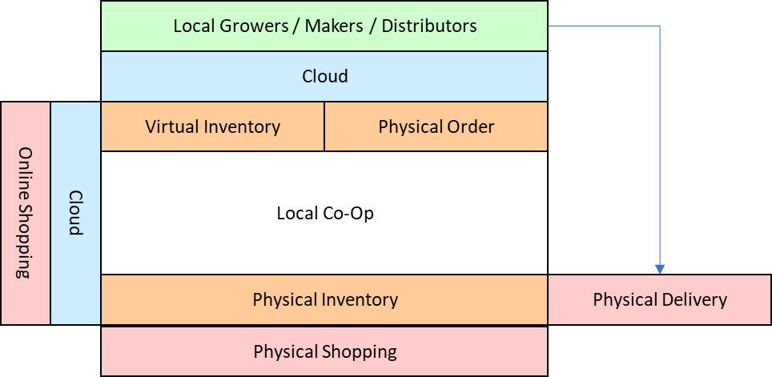

LocalGoods
==========

By Daniel Patterson, MCSD (danielanywhere)

The current prototype version can be seen and used at
<https://LocalGoods.azurewebsites.net>

Index
-----

-   [Introduction](#introduction).

-   [Project Goals](#project-goals).

    -   Grower / Maker.

    -   Packager / Producer / Distributor.

    -   Consumer.

Introduction
------------

Imagine combining the ease of online shopping giants with the social
responsibility and nutritious benefits of both the slow foods and
farm-to-fork movements.

Everywhere around the country, we are seeing reports of farmers and
ranchers who have excess product to sell to any willing buyers, while at
the supermarket, much of that product never becomes available to the end
consumer. Instead, there are extreme wastes occurring in a system that
was not ready for any kind of change from the status quo of the late
20th century.

In some cases, the bottleneck lies at the meat packer or mid-level
producer, while at others, it is a simple lack of packaging that keeps
perfectly fine product from being displayed in the store.

Meanwhile, many communities have healthy, functioning co-op stores that
not only enjoy the many benefits of local, organic product availability,
but who also often have contact information for growing their supply
exponentially, if needed.

So, in consideration of increasingly limited supplies available in the
commercial supermarket, why haven't we all migrated to our local co-ops
already so that we can increase support for our local growers and
producers?

There might be multiple reasons we haven't switched to supporting our
local economy more fully, but this designer personally believes the main
obstacle is only a lack of awareness.

Our culture has lived almost 100 years totally disconnected from our
local producers, and now that we are reentering a time in which local
sustenance will be the only reliable form of survival for at least some
period of time, one thing that can really help both the local producers
and our local co-op simultaneously is to make all of the information
about local product availability accessible online.

Project Goals
-------------

Multiple distinct types of operations are required to get food from the
settings where raw vegetation and animals are grown on an extremely
large scale to an individual serving on the consumer's plate. In the
recent past, this was a highly proprietary process handled by
large-scale organizations, and there wasn't much publicly available
information about any of the steps between the farm and the plate,
although at the ends of the scale, farming and eating are two
professions that a lot of people seem to know a lot about.

The goal of this project can be stated in the single phrase:
*Farm-to-fork*. The activities implied by this phrase are as diverse as
the day is long, and often distributed into specific segments of
specialization.

In the first versions of the system, we will attempt to get the
functionality of the modules focused on one of the three following
levels.

### Grower / Maker

The grower or original product maker is the source of the local
products. Depending upon the output product, this individual needs to
purchase grain, soil, seeds, fertilizer, breeding stock, equipment,
consumable supplies, and other additional resources.

This individual will most likely be selling to distributor-level parties
who can handle the next steps of preparation for the consumer, although
he or she can also provide some or all of the final preparation of that
product to receive selling prices approaching the final retail value of
the product, depending upon the facilities and capabilities available at
the source property.

In the above flow chart, the potential activities of a vegetable farmer,
and in the following block diagram, some typical activities of a meat
producing cattle rancher.

One interesting characteristic to keep in mind about the cyclical nature
of markets is that even a large cattle rancher with 1,000 head of
grazing cattle will purchase consumer amounts of corn, tomatoes, and
possibly even beef on a daily basis. This indicates that the visitor's
role on the database should be switchable at any time between vendor,
producer, and consumer.

### Packager / Producer / Distributor

In the first versions of this system, all production and distribution
functions are hosted at the same role level to help keep the logistics
of the system to a minimum. However, a number of functions should be
built into the system that allow any mid-level party to perform
exchanges with any other.

For example, a hay farmer might place his bails up on the site for sale
in the area to be immediately picked up by a warehousing operation that
ultimately stores them until fall. In the fall, they are picked up by
another distributor who is gathering as many bails as possible for a
large ranch 100 miles away. In several cases, the final distributor ends
up making transactions with several other handlers prior to the final
transaction with the ranch.

In the above flow chart, a vegetable distributor, and in the following
flow chart, some of the general activities of a meat packager and
distributor.

In the earliest versions, activities at the mid-level are considered to
be anything that needs to be done to break the high-volume specialized,
dirty, unprepared, unpackaged product down into well-defined consumable
volumes suitable for individuals and small families.

### Consumer

Although the fewest transitions occur at this stage of production, the
fork end of the farm-to-fork concept offers a number of conveniences
specifically suited for individual consumption.

All of the activities at the higher levels of the system are meant to
provide the type of infrastructure that can supply the final product to
the consumer, meeting the following goals, among others.

-   Serving sizes that fit well within the kitchen storage areas of the
    typical home or apartment.

-   General cleanliness and a good basic level of presentation.

-   Zero-risk browsing product offerings from farmers, makers, and local
    co-op centers.

-   Shopping list creation and maintenance.

-   Online ordering for curbside pickup or direct in-area home delivery.

-   Reordering capabilities for often used products.

-   Custom ordering capabilities for unstocked items.

The initial phases of the online consumer shopping model are illustrated
in the following block diagram.

